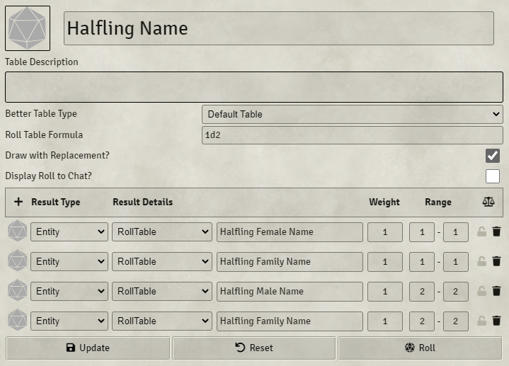

# All Goblins Have Names

A module for Foundry VTT. Allows you to use a table as the Display Name for a token so each new
token will get a random name. It can also roll random biographies for tokens when used with [Better Rolltables](https://foundryvtt.com/packages/better-rolltables/).

## How to use it

First, grab your random name table and drag it into a Journal entry. That will give you some
text that looks similar to `@RollTable[2cbm3cP46dxcxO5Z]{Dwarf Female Name}`. Now, open the Actor
and click Prototype Token. Paste your `@RollTable[...` text into the Token Name. When you drag your Actor
onto the map to create a new Token, its name will be randomized!

### Return more than one result for firstname + lastname

When multiple lines are returned from a table, the lines will be joined together with a space. For example, you could have a roll table formula of 1d1, and have two results which are also tables for a firstname and a lastname, both with range 1-1.

## Random biographies with Better Rolltables

If you install the module [Better Rolltables](https://foundryvtt.com/packages/better-rolltables/), you can also generate random biographies. Create a Story Table, then place a reference to it as the first line of the biography. For example, you can use the Random NPC Story Table that comes with the BetterTables mod: `@Compendium[better-rolltables.brt-story.8vjHa6SoZibxeTke]{Random NPC}`. This currently supports the Simple Worldbuilding system, D&D 5e, HarnMaster, or any system with the data formats of...

- `actor.data.data.biography` (Simple Worldbuilding)
- `actor.data.data.details.biography.value` (D&D 5e)

Note: This will only work for tokens with "Link Actor Data" unchecked.

## Installation

You can install this module through the Foundry module UI

## Get help

You can [file an issue](https://github.com/toastygm/all-goblins-have-names/issues/new) on github if
you're running into a bug or reach me on the Foundry VTT discord as toasty#8538.
